---

First set of exercises called Basics from first handful of labs briefly touches on set of fundamental tools

- PCA (Principal Component Analysis)
- K-means clustering
- Agglomerative Clustering
- t-SNE (t-Distributed Stochastic Neighbor Embedding)
- Performance metrics (accuracy score)
- NumPy - For numerical operations and array manipulations
- Matplotlib - For data visualization and plotting results
- Simple caching and discussion when to store results

finishing with an exercise about identifying contaminated samples in spectroscopic images of blood samples

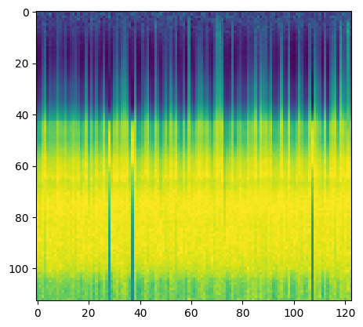

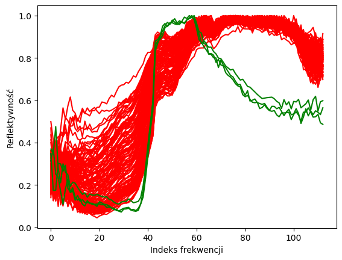

---

In lab_2, we used clustering to distinguish between real and fake blood samples on a noisy background plate.

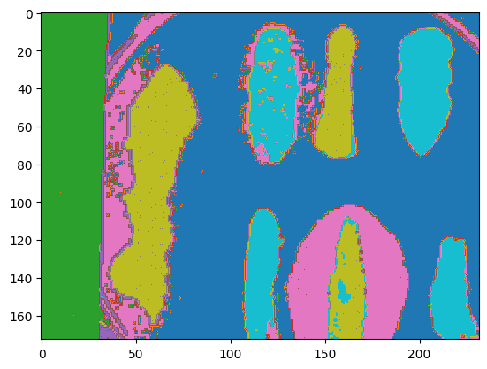

---

In lab_3, we explored ways to score results using metrics such as accuracy_score, precision_score, confusion_matrix, recall_score, f1_score. Explored what they are and when to use which.

We also explored cross_val_score, which lead to hyperparameter optimization with GridSearchCV. We finished the lesson by saving and loading our optimized model to and from hard drive to save time.

---

We started off lab_4 by learning about model pipelines, which we used to streamline process of creating well, a pipeline of models... We also explored SVC from Support Vector Machines, state of the art supervised algorightms for optimal hyperplanes separating classes.

We brefly touched on decision forest, then we moved on to creating our first unsupervised classifier MLPClassifier (neural network classifier)

---

lab_5 was much more theoretical. We rehorsed some fundamental definitions (what is data? what is information? Knowledge even.) before we ventured to the world of timeseries and statistical verification.

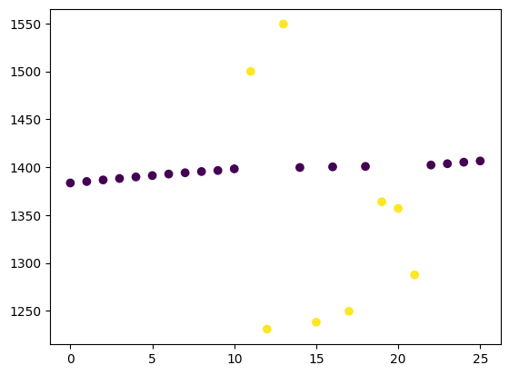

---

in lab_6 we trained a nerual netowrk regressor model for timeseries prediction, we also learned how to evaluate trained models.

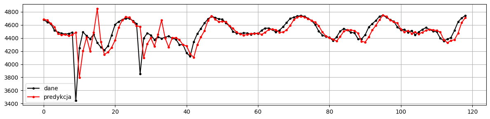

---

lab_7 and lab_8 we explored the history of unsupervised learning. It was our introduction to pytorch. We created a convolutional nerual network from scratch and how to use pytorch Dataset class to train it. Then we saved the model to filesystem for future use.

---

in lab_9 we compared our model to lenet, one of the earliest convolutional neural netowrks. Then we explored how to access neural networks with pytorch, how to optimize them for our use case with additional training

---

lab_10 was also more of a theory based lesson, where we explored ways to generate training samples using data augmentation techniques 

---

in lab_11 we took a detour from nerual networks and explored RandomForestClassifier for creating explainable and understandable classification

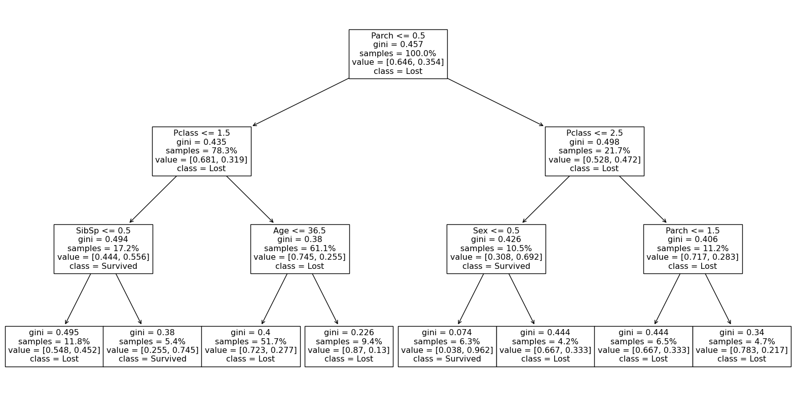

---

In own_misc section I explored an advanced exercises on my own. First of all I magaged to match the blood from one of exercises to the sample given in basics section

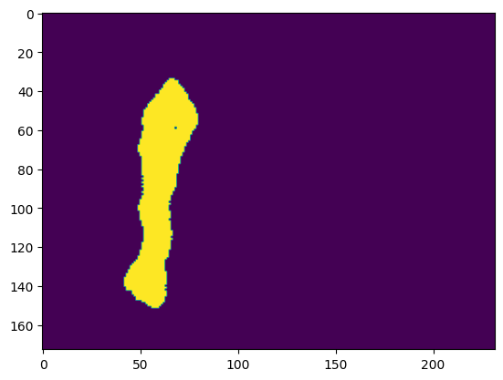
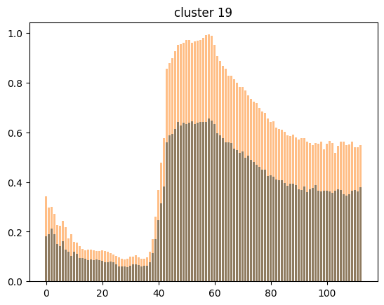

In second part of this exercise, I managed to isolate blood stained on a background resembling a real crime scene

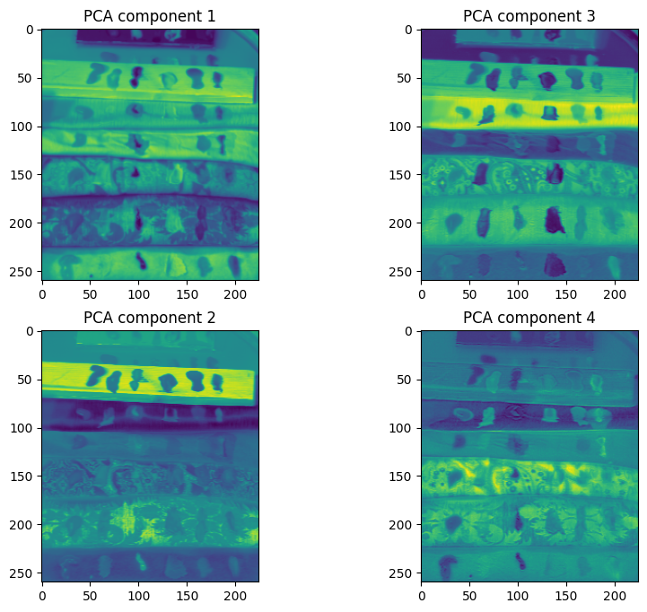
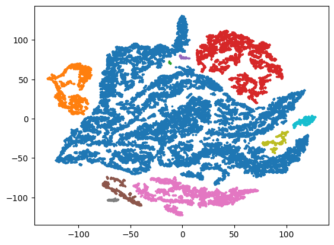
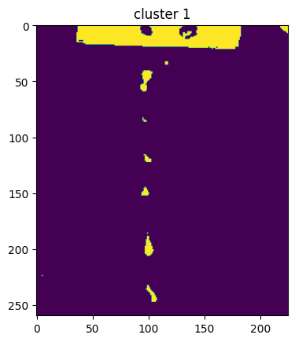

In own_cluster_classify, I assigned a set of labels to each shopper and predicted shopper label with associated purchases for any position on the 2d representation of the dataset.

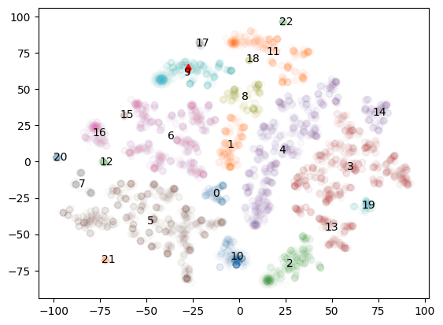

lastly I tried to hack jupyter notebook by creating an interactive interface with d3 by serving filed directly from within the editor (bad idea)

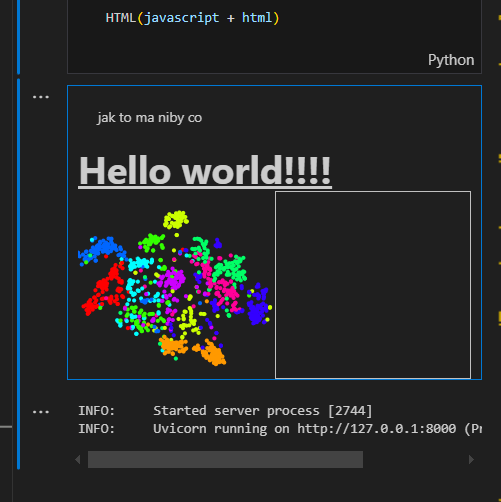

